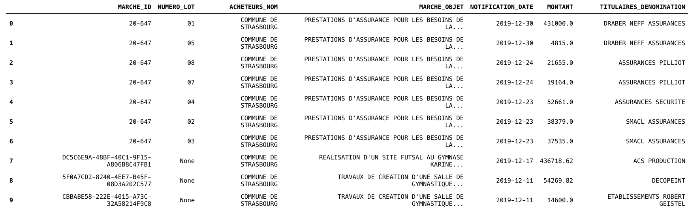
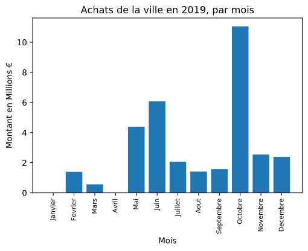
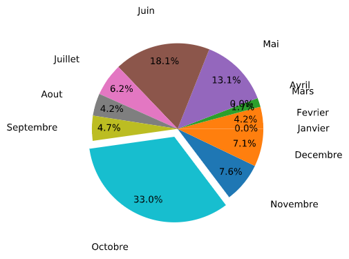
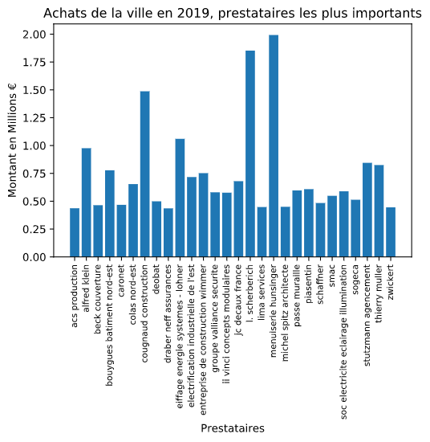

# Analyse de données
 
## Projet IPython visant à représenter visuellement les données publiées sur [Data Gouv](https://www.data.gouv.fr/fr/datasets/achats-des-principales-communes-francaises-en-2019/) afin de les rendre lisibles facilement. Cas pratique: achats de la commune de Strasbourg en 2019.
 
## Organisation en 3 axes principaux:
 
1. ### Mise en place d'un ****environnement virtuel Python****
  - On choisit pour ce propos un environnement ****Anaconda**** comportant les libraires et modules adéquats pour le ****traitement, nettoyage et la représentation visuelle**** des données
 
2. ### Traitement des données
  - Création des objets ****Pandas DataFrame****.
  - Nettoyage des lignes portant des cases majoritairement vides.
  - **Groupement par colonnes** ou _'groupby'_
  - ajout de colonnes et d'autres éléments supplémentaires pour avoir une table plus exploitable.
 
3. ### ****Représentation visuelle****
  - avec des graphiques traditionnels grâce aux outils ****Matplotlib****
 
## Attentes:
  - Pouvoir tirer des information utiles afin de pouvoir interpréter certains aspects des achats de la commune.
  - Rendre l'analyse facilement réplicable
 
---
 
# 1. Environnement Virtuel
 
- Installation [Anaconda](https://www.anaconda.com/products/individual). Guide d'installation figure dans le site ci contre
 
- Une fois Anaconda installé:
 - Sous système type UNIX, ouvrir un terminal et saisir:
   - ```
       $ conda create --name nom_environnement
       $ conda activate nom_environnement
       ```
 - Installation des librairies nécessaires
   - ```
       $ conda install pandas matplotlib
       ```
       (Selon la distribution conda choisie, ces librairies peuvent être installées par défaut)
 
 - Optionnel: installation de **Jupyter Notebooks**.
 On choisit Jupyter Notebooks pour sa facilité d'utilisation et pour l'aspect interactif ou exécution par blocs de code.
   - ```
       $ conda install -c conda-forge jupyterlab
       ```
 
### Une fois notre environnement créé et activé, ouvrir un Notebook Jupyter ou un éditeur de texte a choix
 
---
 
# 2. Traitement des données
 
Pour faciliter la démarche, il convient de télécharger le fichier avec les données sous format .csv et de les sauvegarder dans le même dossier ou on a créé notre fichier _.ipynb_.
 
- Importation des librairies
```Python
import pandas as pd
import matplotlib.pyplot as plt
```
- Création de notre objet DataFrame principal
 ```Python
sxb = pd.read_csv('sxb.csv', sep=';')
 
# Supprimer les files ou toutes les cases sont vides
sxb.dropna(how='all', inplace=True)
 
# Visualiser les 10 premières files de la table
sxb.head(10)
```
Nous observons une table de la forme suivante
 

 
## 2.1 Opérations sur les données en fonction des mois
 
### 2.1.1 On crée tout d'abord une colonne pour le mois, pour pouvoir représenter graphiquement les achats de la commune par mois
 
```Python
# Prendre le mois dans la colonne 'DATE' en format 'int'
sxb['MOIS'] = sxb['NOTIFICATION_DATE'].str[5:7].astype(int)
 
# Convertir le type des cases 'MONTANT' en 'float' lorsque possible
sxb['MONTANT'] = pd.to_numeric(sxb['MONTANT'],errors='coerce')
```
### 2.1.2 Manipulations sur cette nouvelle colonne
 
```Python
# Groupement de la table par mois
depenses_par_mois = sxb.groupby('MOIS').sum()
 
# création d'une colonne pour représenter la fraction du montant total
depenses_par_mois['MONTANT RELATIF'] = depenses_par_mois['MONTANT'] * 100 / total2019
depenses_par_mois = depenses_par_mois.reset_index()
 
# calculer les pourcentages des montants
pourcentages = depenses_par_mois['MONTANT RELATIF']
```
 
## 2.2 Opérations sur les données en fonction des entreprises
 
```Python
# seuil arbitraire en dessous duquel nous ne traiterons pas
seuil = 400000.0
```
 
### Transformer en minuscules
```Python
sxb['TITULAIRES_DENOMINATION'] = sxb['TITULAIRES_DENOMINATION'].str.lower()
```
 
### Regroupement par entreprise
```Python
depenses_par_prestataire = sxb.groupby('TITULAIRES_DENOMINATION').sum()
```
 
 
### Application du seuil pour filtrer les petits achats
```Python
top_depenses_par_prestataire = depenses_par_prestataire[depenses_par_prestataire['MONTANT'] > seuil]
top_depenses_par_prestataire = top_depenses_par_prestataire.reset_index()
```
 
## 2.3 Opérations sur les données en fonction des achats individuels
 
### Convertir en minuscules les cases portant l'objet de l'achat
```Python
sxb['MARCHE_OBJET'] = sxb['MARCHE_OBJET'].str.lower()
```
 
### Grouper la table par objet d'achat et en faire de ces derniers l'indice
```Python
depenses_par_projet = sxb.groupby('MARCHE_OBJET').sum()
depenses_par_projet = depenses_par_projet.reset_index()
```
 
### Filtrer les achats les plus petits
```Python
top_depenses_par_projet = depenses_par_projet[depenses_par_projet['MONTANT'] > seuil]
```
 
---
 
# 3. Représentation Graphique
 
## Achats de la commune par mois
 
 
 
## TODO: Interpretation
 
## Achats de la commune par entreprise
 

 
 
## Projets les plus importants
 

 
---
 
# Conclusion:
 
### Les données trouvées sur Open Data sont facilement traitables et bien classifiées, le nettoyage a faire est minime et les visualisations semblent satisfaisantes car répondent parfaitement aux attentes
 
Limites de cette étude:
- On a choisit de représenter les données qui nous sont fournies sans forcément les interpréter, en effet, une approche plus rigoureuse en terme de statistiques est requise pour cela.
- La manière dont ces données ont été saisies, nous limite en terme de possibilités de traitement. Parmi des améliorations possibles on peut citer, une colonne qui catégorise par domaine d'activité les achats de la commune.
- De même, un fichier identique pour plusieurs années pourrait vraiment donner de l'ampleur à une analyse comme celle effectuée ci dessus, sans forcément déployer de moyens plus sophistiqués.


    